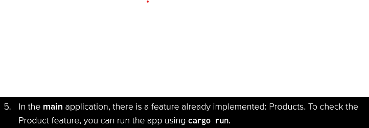

## __*Module 7*__

# __Page 96__



```text
which "main", Rust, Java, bambangshop, or bambangshop-reciever?
Page 95 said "This repository contains the publisher (or main) application.", which implies T or F that publisher == main.
```

# __Reflection__
```text
1. Yes. trait allows multiple types. Thus more flexibility.
2. Small case, no. Large case, yes. DashMap O(1), Vec O(n).
3. Both.
```